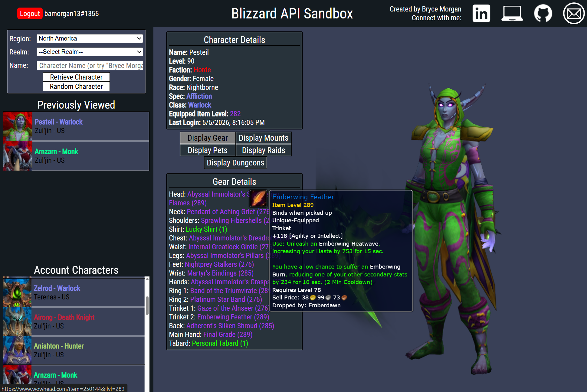

# Blizzard API Sandbox

The [Blizzard API Sandbox](https://blizzard-api-sandbox.herokuapp.com/ "Blizzard API Sandbox Live Site") is a quick demonstration of front-end web development, interfacing with the Blizzard API as well as incorporating Wowhead tooltips.
Since its conception, the app has been expanded to include a Flask backend in order to securely interface with the Blizzard client authorization as well as incorporating Docker for deployment to Heroku.



### Functionality
The app is currently able to
* Fetch realm data based off of selected region
* Fetch characters via search or OAuth with Blizzard to automatically pull your own character data
* Fetch basic character information, such as level, class, avatar, etc.
* Display currently equiped gear, with Wowhead tooltips for each piece
* Cache previously retrieved character and equipment data to prevent unnecessary requests
* Display history of viewed characters to aid in caching demonstration
* Display pet and mount collections, as well as filter these results
* Display dungeon and raid progress for the character
* Link to appropriate Wowhead articles for each piece of gear, collectible, and instance

### Architecture and Technologies
* Flask allows for a backend server to securely interface with the Blizzard authentication API
* React is used to render HTML, utilizing hooks to maintain completely functional components
* Redux caches character data so in a systematically organized fashion for ease of lookup and reduced calls to the Blizzard API
* Node-sass enables the use of `.scss` files for more powerful CSS creation
* ReactTooltip implements a quick and easy tooltip for links to my personal webpages
* Docker containerizes the application for easy Heroku deployment

### Interesting Code Segments
The fetching of character data is particularly interesting because it goes through multiple checks, fetching from multiple Blizzard API endpoints, a stripping of unnecessary data, and a systematic storing of this data by dynamically generating a character-specific key. 
```js
// store/characters.js

// Fetches character data and media (images) from Blizzard API
export const fetchChar = (region, realm, name, oAuth) => async (dispatch) => {
	// If the user did not submit either a realm or a region, do not attempt a fetch
	// Dispatch that the character was not found to indicate a review is needed
	if (!(realm && name)) {
		dispatch(setCharNotFound());
		return;
	}

	const charRes = await fetch(
		`https://${region}.api.blizzard.com/profile/wow/character/${realm}/${name}?namespace=profile-${region}&locale=en_US`
		{
			headers: {
				'Authorization': `Bearer ${oAuth}`
			}
		}
	);
	const charData = await charRes.json();

	// After the fetch, if Blizzard responds with an error, indicate it was not found
	if (charData.detail && charData.detail === 'Not Found') {
		dispatch(setCharNotFound());
		return;
	} else {
		// Only upon successfully fetching a character do we then attempt to fetch media
		// The request is made with the href provided in the initial fetch
		const mediaRes = await fetch(charData.media.href,
			{
				headers: {
					'Authorization': `Bearer ${oAuth}`
				}
			});
		const mediaData = await mediaRes.json();

		// Data from both fetches is compounded before being dispatched to Redux
		const selectedData = selectCharInfo(region, charData, mediaData);
		// A unique character key is generated combining the region, realm, and name
		// This is used in multiple slices of the Redux store to retrieve cached data
		const charKey = `${region}_${realm}_${name}`;
		dispatch(receiveChar(charKey, selectedData));
		return selectedData;
	}
};
```
The helper that makes this particularly useful is the `selectCharInfo` function. This is the selector that converts the giant data objects received from the Blizzard API into a streamlined object containing only the data that we need in the app. It's also useful in that it combines the data from both fetches into one object so that the media data does not need to be stored in a separate location.
```js
// store/selectors.js

// Strips the large character and media objects down to data that will be used by the app
export function selectCharInfo(region, charData, media) {
	const assets = {};
	media.assets?.forEach((asset) => {
		assets[asset.key] = asset.value;
	});

	// Account for some older characters having different formatting if they have not logged in recently
	assets.avatar = media.avatar_url || assets.avatar;
	assets.inset = media.bust_url || assets.inset;
	assets["main-raw"] = media.render_url || assets["main-raw"];
	
	return {
		name: charData.name,
		region,
		realm: {
			name: charData.realm.name.en_US || charData.realm.name,
			slug: charData.realm.slug
		},
		level: charData.level,
		faction: charData.faction.name.en_US || charData.faction.name,
		gender: charData.gender.name.en_US || charData.gender.name,
		race: charData.race.name.en_US || charData.race.name,
		spec: charData.active_spec.name.en_US || charData.active_spec.name,
		class: charData.character_class.name.en_US || charData.character_class.name,
		ilvl: charData.equipped_item_level,
		guild: charData.guild ? charData.guild.name : 'No Guild',
		lastLogin: new Date(charData.last_login_timestamp).toLocaleString(),
		assets
	};
}
```

### Future Development
Future plans for the app include
* Ensuring responsive design at all screen sizes
* Displaying character Mythic+ data
* Displaying a wider variety of character and account data such as housing collections and achievements
Expand upon the backend to allow the app to
* Have users log in to store their history
* Store favorite searches
* and much more!

